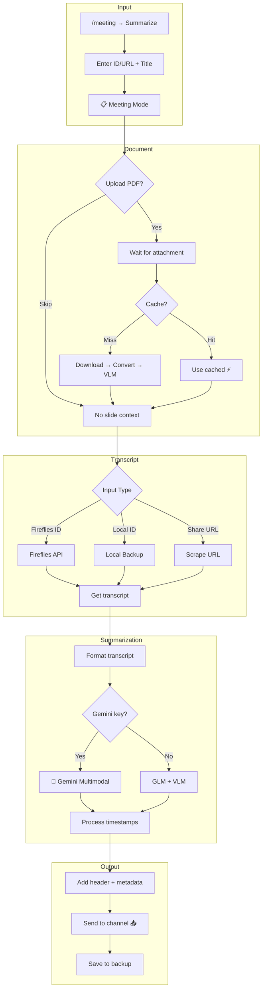
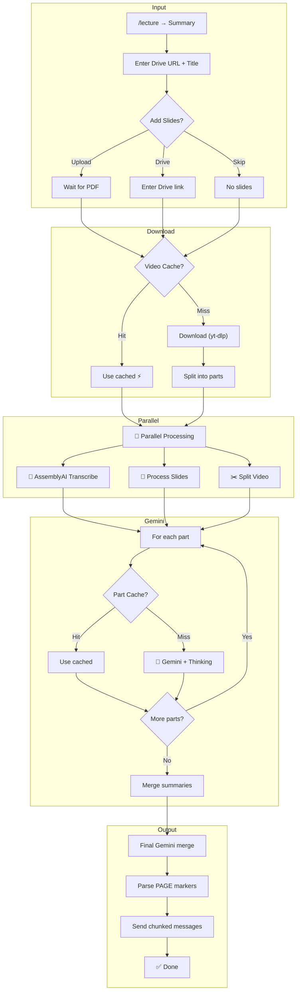
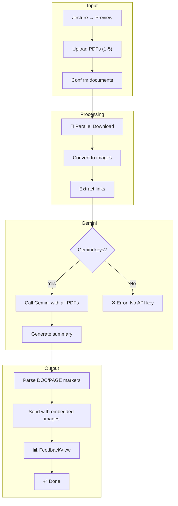

# AIO Assistant - Discord Bot for Group Meetings & Learning

AI-powered Discord bot that streamlines group meetings and enhances the learning experience for AIO (AI Online) courses. Integrates with Fireflies.ai for meeting recordings, AssemblyAI for transcription, and Gemini/GLM for intelligent summarization.

**Multi-key Gemini Support** - Each user can configure up to 5 API keys with automatic rotation when rate limits are hit.

## Core Features

### 🎙️ Meeting Module (`/meeting`)
| Feature | Description |
|---------|-------------|
| **Join Meeting** | Bot joins and records Google Meet/Zoom via Fireflies |
| **Smart Summarization** | Summarize transcripts with Gemini (primary) or GLM (fallback) |
| **Audio Transcription** | Scrape audio from Fireflies → transcribe with AssemblyAI |
| **Multimodal Processing** | Process PDF slides + transcript in a single Gemini call |
| **Document Upload** | Upload PDF slides (up to 200 pages) for context-aware summaries |
| **Auto References** | Extract and describe links from PDF slides |
| **24h Slide Cache** | Cache VLM output for faster fallback processing |
| **Meeting Scheduler** | Schedule automatic meeting joins |
| **Archive Backup** | Backup transcripts to Discord channels |
| **Whitelist Protection** | Protect important transcripts from deletion |

### 📚 Lecture Module (`/lecture`)
| Feature | Description |
|---------|-------------|
| **Video Summarization** | Summarize lecture videos from Google Drive or direct URLs |
| **Gemini with Thinking** | Uses Gemini 2.5 Flash with deep thinking mode |
| **AssemblyAI Transcription** | Transcribe audio from videos (~100h free/month) |
| **Slide Integration** | Upload slides via Drive link or file attachment |
| **Chat Session Upload** | Upload chat .txt files with Q&A, quizzes, and community insights |
| **Quiz Extraction** | Separate Q&A and quizzes with detailed answer explanations |
| **LaTeX Rendering** | Block formulas `$$...$$` → images, inline `$...$` → Unicode |
| **Parallel Processing** | Download, transcribe, and process slides simultaneously |
| **Multi-stage Cache** | Cache videos, transcripts, slides, and partial summaries |
| **Preview Mode** | Summarize multiple PDFs (1-5 files) before class |

## Commands

| Command | Description |
|---------|-------------|
| `/help` | Display available commands |
| `/config` | Configure API keys, prompts, channels, and limits |
| `/meeting` | Meeting actions menu |
| `/lecture` | Lecture actions: Video/Transcript mode, Preview, API config |

### Meeting Actions
- 📋 **List from Fireflies** - View transcripts on Fireflies (with 🛡️ whitelist badge)
- 📥 **View Backup** - Browse backup transcripts with pagination
- ✏️ **Summarize** - Summarize from ID/URL
- 📝 **Edit Title** - Rename transcript and re-upload backup
- 🚀 **Join Now** - Bot joins meeting immediately
- 📅 **Schedule** - Schedule automatic join
- 🛡️ **Manage Whitelist** - Toggle transcript protection

### Lecture Actions
- 🎬 **Record Summary** - Summarize video with Gemini
- 📄 **Preview Slides** - Summarize multiple PDF documents (1-5 files)
- 🔑 **Gemini API** - Manage multi-key configuration (max 5)
- 🎙️ **AssemblyAI API** - Set personal AssemblyAI API key

## AI Capabilities

| Capability | Description |
|------------|-------------|
| 🤖 **Deep Thinking** | VLM/LLM uses thinking mode for deeper analysis |
| 📄 **Multimodal Gemini** | Process PDF slides + transcript in one call |
| 📄 **VLM Slide Extraction** | Fallback: Extract content from slides with GLM |
| 🎬 **Video + Slides + Transcript** | Full multimodal processing |
| 💬 **Community Insights** | Auto-filter chat sessions for Q&A and explanations |
| 📚 **Auto References** | Extract and describe links from PDFs and chat |
| 🔢 **LaTeX Rendering** | Convert formulas to images or Unicode |
| 💾 **Multi-layer Cache** | Cache all processing stages |
| ⏱️ **Smart Timestamps** | Convert `[-123s-]` and `[-PAGE:X-]` markers to clickable links |
| 🔄 **Error Recovery** | Retry buttons + Continue/Cancel options |

## Architecture

```
src/
├── bot.py                     # Bot core + cog loader
├── main.py                    # Entry point
├── cogs/
│   ├── meeting/               # Meeting commands
│   │   ├── cog.py             # Meeting cog + Views
│   │   ├── modals.py          # UI Modals + ErrorRetryView
│   │   └── document_views.py  # Document upload + VLM
│   ├── lecture/               # Lecture commands
│   │   ├── cog.py             # Lecture cog + API config views
│   │   ├── video_views.py     # Video processing + error views
│   │   └── preview_views.py   # Multi-doc preview processing
│   ├── shared/                # Shared UI components
│   │   └── gemini_config_view.py  # Multi-key Gemini config UI
│   └── system/                # System commands
│       ├── config.py          # Config cog + Global API keys
│       └── help.py            # Help cog
├── services/
│   ├── config.py              # Guild config + multi-key personal API
│   ├── gemini_keys.py         # Key pool + rotation + usage tracking
│   ├── discord_logger.py      # 3-channel Discord logging
│   ├── prompts.py             # Meeting/Lecture VLM/LLM prompts
│   ├── fireflies.py           # Fireflies transcript formatter
│   ├── fireflies_api.py       # Fireflies GraphQL API
│   ├── fireflies_scraper.py   # Scrape audio from Fireflies + AssemblyAI
│   ├── llm.py                 # GLM API (VLM + LLM, optional)
│   ├── gemini.py              # Gemini API + personal key pool
│   ├── video.py               # Video processing (split, frames)
│   ├── video_download.py      # yt-dlp + Google Drive download
│   ├── assemblyai_transcript.py  # AssemblyAI transcription
│   ├── lecture_cache.py       # Multi-stage lecture caching
│   ├── slides.py              # PDF → images conversion
│   ├── scheduler.py           # Meeting scheduler + cache cleanup
│   ├── slide_cache.py         # 24h slide content caching
│   └── transcript_storage.py  # Local storage + archive
└── utils/
    ├── document_utils.py      # PDF → images (max 200 pages)
    └── discord_utils.py       # Chunked message sending + pages
```

## Testing

```bash
# Run all lecture tests
pytest tests/lecture/ -v

# Run specific test file
pytest tests/lecture/test_chat_processing.py -v
pytest tests/lecture/test_latex.py -v
```

| Test File | Coverage |
|-----------|----------|
| `test_chat_processing.py` | Chat parsing, link extraction, filtering |
| `test_link_extraction.py` | PDF link extraction, formatting |
| `test_output_parsing.py` | Timestamp markers, page markers, multi-doc |
| `test_latex.py` | LaTeX → Unicode, image rendering |

## Pipelines

### Meeting Summary Pipeline



### Lecture Video Pipeline



### Preview Slides Pipeline



## Setup

```bash
# Install dependencies
uv sync
playwright install chromium

# Configure environment
cp .env.example .env
nano .env

# Run
uv run python src/main.py
```

## Deployment

```bash
# Deploy to AWS
AWS_HOST="ubuntu@your-ip" AWS_KEY="~/.ssh/your-key.pem" bash deploy.sh
```

## Bot Permissions

Required Discord permissions (integer: `274877975552`):
- Send Messages, Read Message History
- Manage Messages
- Use Application Commands
- Embed Links, Attach Files

## Configuration

### Environment Variables

| Variable | Required | Description |
|----------|----------|-------------|
| `BOT_TOKEN` | ✅ | Discord bot token |
| `GUILD_ID` | ❌ | Test server ID (faster sync) |
| `GLM_BASE_URL` | ❌ | Z.AI API base URL |
| `GLM_MODEL` | ❌ | LLM model (default: GLM-4.5-Flash) |
| `GLM_VISION_MODEL` | ❌ | VLM model (default: GLM-4.6V-Flash) |

> **Note:** API keys (Gemini, GLM, Fireflies, AssemblyAI) are **guild-specific only** with no environment fallback. Each guild must configure via `/config > Set API Keys`.

### Guild API Keys

| Key | Used For |
|-----|----------|
| `fireflies_api_key` | Join Meeting, List Transcripts |
| `glm_api_key` | Meeting/Lecture summarization (fallback) |
| `gemini_api_key` | Guild automation, scheduled summaries |
| `assemblyai_api_key` | Meeting transcript (Fireflies audio → text) |

## Process Logging

All processes are logged to Discord tracking channels:
- **Preview Slides**: Document URLs/names, success/error
- **Lecture Summary**: Video URL, slides URL, chat session attachment
- **Meeting Summary**: Success/error with user info
- **Join Meeting**: Success/error status
- **Schedule Meeting**: Confirmation and status

## Performance Optimizations

| Optimization | Description |
|--------------|-------------|
| **PDF Conversion** | Batch 5 pages at a time (~15MB peak RAM) |
| **Fireflies Scraper** | Direct transcript_id pattern matching |
| **Gemini Keys** | Multi-key rotation with per-user usage tracking |
| **Multi-stage Cache** | Video, transcript, slides, and summaries cached |

## Supported Platforms

- Google Meet
- Zoom
- Microsoft Teams
- [+ more integrations](https://fireflies.ai/integrations)

## License

MIT